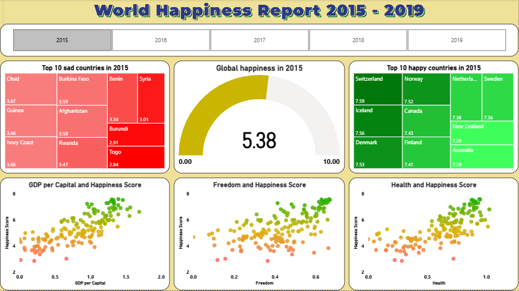

# 🌍 World Happiness Report Dashboard (2015–2019)

This project analyzes the **World Happiness Report** data from 2015–2019 using **Power BI**.

## 📊 Dashboard Features
- Year-wise happiness analysis with slicers
- Top 10 happiest & saddest countries (Treemap)
- Global Happiness Gauge (KPI)
- Correlation scatterplots:
  - GDP per Capita vs Happiness
  - Freedom vs Happiness
  - Health vs Happiness
- Regional & country-level insights

## 🗂 Dataset
Data sourced from World Happiness Report (2015–2019).  
Cleaned & transformed in **Power Query**.

## 📷 Dashboard Preview

## 🚀 How to Use
1. Clone the repository
2. Open the `.pbix` file in Power BI Desktop
3. Explore the visuals interactively

## 📌 Tools Used
- Power BI
- Power Query
- Excel (Data Cleaning)

